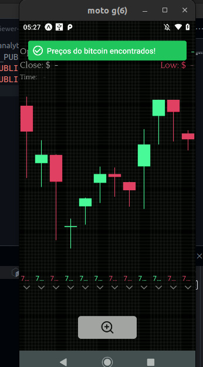
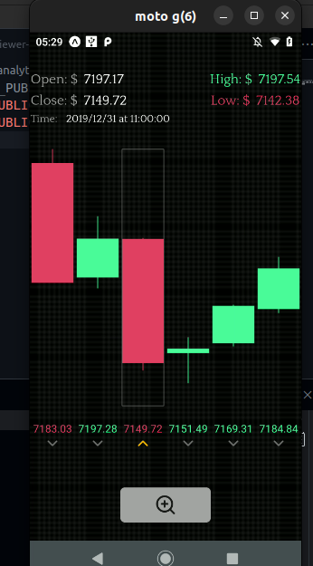
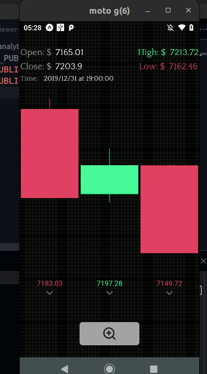
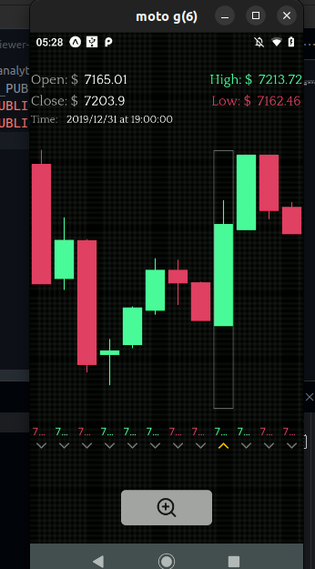
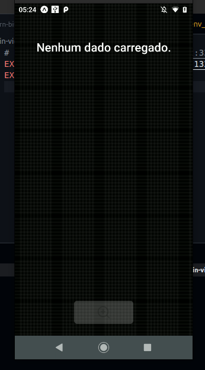

<h1 align="center">Projeto - React Native/NodeJS/Mongodb/Docker/pm2/RabbitMQ: bitcoin candlesticks</h1>

<p align="center">
  

  

  
  
  <a href="https://github.com/williamjayjay/Github-Blog/commits/master">
    
  </a>
    
   <a href="https://github.com/williamjayjay/poc-RN-Node-RabbitMQ/stargazers">
    
  </a>
</p>

<p align="center">Vamos construir um serviço com rabbitmq, uma api em nodejs e um aplicativo em react native<br/><strong>Está é apenas uma POC de um projeto com objetivo de buscar e exibir os preços mais recentes do bitcoin em tempo real.</strong>.</p>

<p align="center">

</p>

## 🥶 Sobre o projeto

Desenvolvi esse projeto para reforçar meu conhecimento com filas e mensageria, e bibliotecas de animação.

## Containers Docker:

**Docker:** Serão executado 2 containers respectivamente, do rabbitMQ e do mongodb.

### Guia de inicialização dos containers docker

Para criar os containers docker, siga estas etapas simples:

1. **Vá para a raiz do diretório btc-candle-generator para criar o container docker do rabbitmq**:
  ```sh
  docker compose up -d
  ```

1. **Vá para a raiz do btc-candle-generator para criar o container docker do mongodb**:
  ```sh
  docker compose up -d
  ```

---

## Serviço Mensageria:

**Mensageria:** O serviço de mensageria foi feito utilizando rabbitMQ, ao qual buscamos os valores do preço do bitcoin na API da coingecko.


## 🚀 Tecnologias

Principais tecnologias que utilizei para desenvolver esta aplicação

- [Amqplib](https://www.npmjs.com/package/amqplib)
- [Typescript](https://www.typescriptlang.org/)
- [PM2](https://pm2.keymetrics.io/)

## Guia de inicialização

Para instalar e configurar uma cópia local, siga estas etapas simples:

### Prerequisitos

Para garantir o funcionamento adequado da nossa aplicação, verifique abaixo:

1. **Clone o repositório**:
  ```sh
  git clone https://github.com/williamjayjay/poc-RN-Node-RabbitMQ
  ```

2. **Navegue na raiz do projeto btc-candle-generator:**

3. **Instale os módulos:**
  ```sh
  bun i
  ```

4. **Copie o .env de exemplo:** 


5. **Instale o [PM2](https://pm2.keymetrics.io/) para rodar o serviço em segundo plano:**
  ```sh
  npm install pm2 -g
  ```

6. **Rode o build do projeto:**
  ```sh
  npm run build
  ```

7. **Execute o arquivo json do PM2 na raiz do projeto:**
  ```sh
  pm2 start pm2.json 
  ```

## Roadmap

- [x] Conectar ao rabbitmq

- [x] Buscar o preço do bitcoin em dollar

- [x] Executar regra para buscar o preço do bitcoin a cada 30 segundos realizar 3 buscas e enviando para a fila os 3 preços 

- [x] Manter sessão ativa em loop, sem quebrar o serviço

---

## Api NodeJS-Express:

**API:** A api realiza a conexão com o canal do rabbitmq para receber o serviço de mensageria 


## 🚀 Tecnologias

Principais tecnologias que utilizei para desenvolver esta aplicação

- [Amqplib](https://www.npmjs.com/package/amqplib)
- [Typescript](https://www.typescriptlang.org/)
- [Express](https://expressjs.com/)
- [Mongoose](https://mongoosejs.com/)
- [Morgan](https://www.npmjs.com/package/morgan)
- [SocketIO](https://socket.io/pt-br/)
- [PM2](https://pm2.keymetrics.io/)

## Guia de inicialização

Para instalar e configurar uma cópia local, siga estas etapas simples:

### Prerequisitos

Para garantir o funcionamento adequado da nossa aplicação, verifique abaixo:

1. **Clone o repositório**:
  ```sh
  git clone https://github.com/williamjayjay/poc-RN-Node-RabbitMQ
  ```

2. **Navegue na raiz do projeto btc-candle-api:**

3. **Instale os módulos:**
  ```sh
  bun i
  ```

3. **Copie o .env de exemplo:** 

4. **Rode o build do projeto:**
  ```sh
  npm run build
  ```

5. **Inicie o PM2 para iniciar a api em segundo plano:**
  ```sh
  pm2 start pm2.json
  ```

## Roadmap

- [x] Conectar ao mongodb

- [x] Iniciar a api

- [x] Iniciar serviço para consumir mensagens da fila do rabbitmq

- [x] Salvar no mongodb as mensagens entregues pelo rabbitmq

- [x] Emitir a mensagem via websocket com socket.io

---

## Mobile React Native:

**Aplicativo:** O app recebe os preços do bitcoin via api REST e também via socket.io.


## 🚀 Tecnologias

Principais tecnologias que utilizei para desenvolver esta aplicação

- [Typescript](https://www.typescriptlang.org/)
- [SocketIO](https://socket.io/pt-br/)
- [React-Native-Toast-Message](https://www.npmjs.com/package/react-native-toast-message)
- [React-Native-SVG](https://docs.expo.dev/versions/latest/sdk/svg/)
- [React-Native-Safe-Area-Context](https://docs.expo.dev/versions/latest/sdk/safe-area-context/)
- [React-native-Redash](https://github.com/wcandillon/react-native-redash)
- [React-Native-Reanimated](https://docs.swmansion.com/react-native-reanimated/)
- [React-Native-Gesture-Handler](https://www.npmjs.com/package/react-native-gesture-handler)
- [TailwindCSS](https://www.nativewind.dev/)
- [Native-Base](https://nativebase.io/)
- [Expo-Font](https://docs.expo.dev/versions/latest/sdk/font/)
- [Expo-AV](https://docs.expo.dev/versions/latest/sdk/av/)
- [DayJS](https://day.js.org/)
- [D3-Scale](https://d3js.org/d3-scale)

## Guia de inicialização

Para instalar e configurar uma cópia local, siga estas etapas simples:

### Prerequisitos

Para garantir o funcionamento adequado da nossa aplicação, verifique abaixo:

1. **Clone o repositório**:
  ```sh
  git clone https://github.com/williamjayjay/poc-RN-Node-RabbitMQ
  ```

2. **Navegue na raiz do projeto rn-bitcoin-viewer-analytcs:**

3. **Instale os módulos:**
  ```sh
  bun i
  ```

4. **Copie o .env de exemplo:** 

5. **Rode o aplicativo:**
  ```sh
  bun android
  ```

## Roadmap

- [x] Iniciar o aplicativo e verificar se há ou não dados das velas do bitcoin, caso haja exibir o gráfico de velas, caso não exibir mensagem sobre nenhum dado carregado

- [x] Conseguir visualizar o preço do bitcoin em velas candlesticks

- [x] Exibir animação das velas quando carregadas da api

- [x] Receber a cada 1 minuto e 30 segundos novas velas via websocket

  - [x] Soar som de moeda e exibir toast notification quando chegar uma nova vela via websocket

- [x] Ao clicar no botão da lupa, alternar a exibição entre 3, 6 e 9 últimas velas enviadas pela API Rest e pelo SocketIO

- [x] Ao clicar em uma das velas, deve selecionar a mesma, alterar ícones na parte inferior

- [x] Ao clicar em uma das velas, deve exibir na parte superior os preços de abertura, fechamento, mais alto e mais baixo e também a data e hora que foi gerada aquela vela.

<!-- --------------------- -->
## UI UX
UI e UX feita baseada em aplicações ja existentes no mercado e em modelos existentes em plataformas como dribble e behance.

| Tela de início | Tela de início (6) |
|:-------------------------:|:-------------------------:|
|  |  |

| Tela de início (3) | Tela de início Full |
|:-------------------------:|:-------------------------:|
|  |  |

| Tela nenhum dado carregado | 
|:-------------------------:|
|  | 
