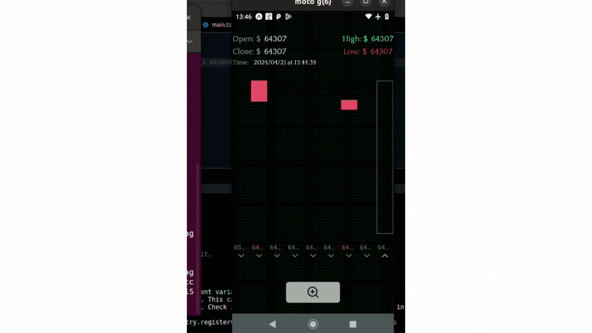
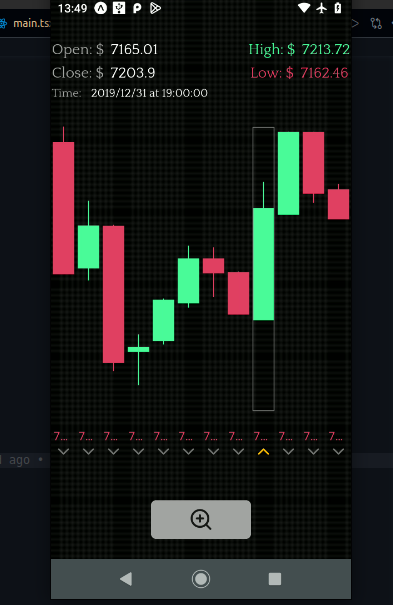
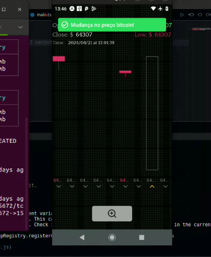

## POC RABBITMQ, NODEJS, REACT NATIVE - BITCOIN TRADE VIEW
Readme em andamento... 

Resumo:
- Serviço com RabbitMQ gerando as candles, e enviando para api em Node(Express) que a mesma é consumida pelo App.

- App também recebendo atualizações dos preços em tempo real com socket.io. RabbitMQ e MongoDB rodando no Docker.

  

- Utilizei o PM2 para rodar o rabbitMQ e a API em node em segundo plano. 

| Tela TradeView | Tela TradeView - Atualizada em tempo real |
|:-------------------------:|:-------------------------:|
|  |  |
